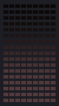

# greendream · 🌙 GreenDream

**By day the building becomes what you tell it. At night it dreams the day back.**

Part of the greenhack family for *Hack 140 with E14 Fund · MIT Green Building · live demo Sept 29, 2026* — turning the MIT Green Building (153 windows, 17 × 9, 30 FPS) into an embodied AI that senses, keeps an internal state, and expresses it in light. Built on top of [Nevin-Thinagar/17x9-Tetris](https://github.com/Nevin-Thinagar/17x9-Tetris) and its `Display.send(Frame)` API.



> Open **`demo.html`** for the full write-up with an interactive replay of the demo (works offline, double-click the file).

## What it is

Anyone, all day, can tell the Green Building what they want to see — a thing, a place, a feeling, a moment — and while it is awake the tower performs it (the Say It engine: a scene spec the model fills, legible by construction). At sunrise it wakes; at sunset it falls asleep. Then it dreams: everything it was told is composed into an arc — opening, rising, turn, climax, resolution, coda — where the day's things recur, merge, invert, rain down as tiny copies and dissolve into sparks, played dim and slow under an indigo cast with the slow breathing of sleep. Each cycle of the night is a new dream; late prompts are absorbed as sleep-talk and woven into the next one. A journal page keeps what people said and what the building dreamt.

## How it works

**Sense**
- Prompts from the simulator text box / Web Speech, or the phone page `/say` (rate-limited, tagged with the channel and the time of day). Text → scene spec through the three-tier Say It path (`library.py`, `genie.py`).
- Real sunrise/sunset for MIT from Open-Meteo (cached, offline sample); an accelerated clock (`--time-scale`) and a phase override for demos.

**Internal state**
- Phase: DAWN → DAY → DUSK → NIGHT from the clock; a day log of every prompt with its spec; awake energy; at night a dream script (title, logline, acts of scenes with sources, dream op, duration, transition) from `dream.py` — Claude via tool-use or the offline composer — played in cycles (descent, dream, surfacing, deep).
- Journal: `journal/YYYY-MM-DD.jsonl` (prompts) and `.dreams.jsonl` (scripts); served live at `/journal`.

**Express**
- Dawn: light floods up from the base, a stretch, two blinks, GOOD MORNING. Day: prompts performed live; between them warm breathing, a wandering gaze, faint daydreams of earlier prompts. Dusk: eyelids close from the top, breathing slows, colours cool, a yawn.
- Night: the dream title climbs once, then the scenes — echo (a smaller copy repeats), merge (two silhouettes cross-fade into one), invert (rise becomes fall), storm-of (tiny copies rain through the tower), fragment (the sprite peels off into sparks) — under the dream filter; sleep-talk is a faint coloured mumble.

## Run it

```bash
pip install -r requirements.txt
python main.py --open                # browser simulator at http://localhost:8000
python main.py --demo --open --offline --journal /tmp/greendream_journal   # scripted hardware-free demo
python main.py --display pygame      # the original DummyDisplay window
python -m pytest -q                  # smoke tests
```

The two halves run side by side out of this one checkout — pixels here, words in `language/`:

```bash
pip install -r requirements.txt -r language/requirements.txt
cd language && uvicorn app.main:app --port 8100   # words: five words in, a scene draft out
python main.py --open                             # pixels: the building, on :8000
python render.py --ingest http://localhost:8100   # preview on :8110, interpreted by the service
```

Each half has its own test suite and is run separately (`python -m pytest -q` here, `cd language
&& python -m pytest` there) — see `HANDOFF.md` §2.1 for why they are never collected together.

**Controls**
- Type / 🎤 Say it · phone page `/say` · `/journal` · Phase selector (auto/dawn/day/dusk/night) · clock speed · hour · 🌙 dream now · ⏭ skip
- `--offline`, `--time-scale 600` (a day in 2.4 min), `--start-hour`, `--journal DIR`; `ANTHROPIC_API_KEY` for open-vocabulary prompts and Claude-written dreams (`ANTHROPIC_MODEL_DREAM`, default claude-sonnet-4-5).

**Hardware (optional)**
- None for the simulator. For the plaza: the Say It pedestal (mic + push-to-talk) or just the QR to `/say`; an LTE hotspot for the API.

## Deploy on the simulator / the building

```bash
# On the organisers' simulator / the real building: any Display subclass works as a plug-in.
python main.py --display path/to/their_driver.py:GreenBuildingDisplay
python main.py --display their_package.driver:GreenBuildingDisplay+web   # mirror it in the browser too
python main.py --display udp:192.168.1.50:5005     # JSON frames over UDP (see common/displays.py to adapt)
python main.py --display record:run.json --gif run.gif --duration 30     # record a clip
python main.py --gentle                             # photosensitivity-safe: no hard whole-building strobes
```

The only contract is `utilities/display.py` (`Frame`, `Color`, `Display.send`). The organisers' driver drops in as a plug-in; a network simulator can be reached through `UDPDisplay` / `HTTPDisplay` in `common/displays.py`.

## Layout

| path | what |
|---|---|
| `app.py` | GreenDream: phases, day performer, dawn/dusk choreography, night cycles, journal |
| `dream.py` | dream script schema, Claude + offline composers, dream ops, DreamScene/DreamPlayer |
| `pages.py` | /say and /journal phone pages |
| `scene.py` | scene spec (incl. beats), validator, particles, motion, Performance |
| `genie.py` | text → spec (library / Claude / lexicon) |
| `library.py` | the warm library: scenes, their beats, aliases, the matcher |
| `render.py` | preview service on :8110: a phrase or a spec becomes a clip a browser can play |
| `worlds.py` | background worlds + transitions |
| `main.py` | entry point |
| `common/` | shared runtime: canvas & effects, 30 FPS loop, display back-ends, browser simulator (`common/web/`) |
| `tests/` | headless smoke tests, the scene contract, the input gate, the digest path |
| `language/` | the language half: the FastAPI service on :8100 that turns five words into a scene draft |
| `FEATURES.md` | the canonical feature list for `language/`: what it does and what is left |
| `demo/` | `recording.json` + `preview.gif` of the scripted demo |
| `utilities/`, `tetris.py` | the upstream Tetris repo, untouched |

## Tuning knobs
- `DREAM_SYSTEM` and `DREAM_SCHEMA`; `compose_offline()` arc; dream ops in `dream_spec()` / `DreamScene`; cycle timings in `_render_night()`; dawn/dusk choreography in `_render_dawn()` / `_render_dusk()`.

## Where to take it next
- An iMessage/SMS channel for remote prompts (dream material) while the QR/pedestal at the building triggers live performances.
- A morning 'dream recap' on the journal page with a GIF of last night.
- Weather and city data (MBTA, Bluebikes) as the building's sleep quality.

---
Upstream README kept as `UPSTREAM_README.md`. Disclaimer inherited: personal educational project, not affiliated with The Tetris Company.
